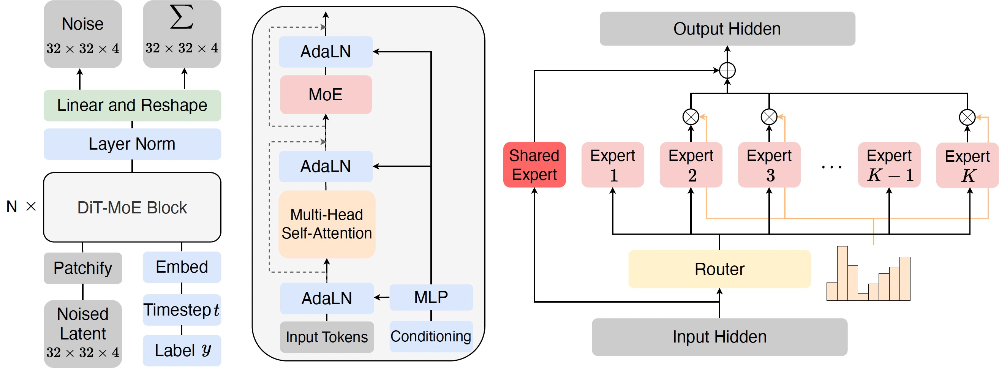

## Scaling Diffusion Transformers with Mixture of Experts <br><sub>Official PyTorch Implementation</sub>

[](https://arxiv.org/abs/2407.11633)

This repo contains PyTorch model definitions, pre-trained weights and training/sampling code for our paper scaling Diffusion Transformers to 16 billion parameters (DiT-MoE).
DiT-MoE as a sparse version of the diffusion Transformer, is scalable and competitive with dense networks while exhibiting highly optimized inference. 

 


* 🪐 A PyTorch [implementation](models.py) of DiT-MoE
* ⚡️ Pre-trained checkpoints in paper
* 💥 A [sampling script](sample.py) for running pre-trained DiT-MoE 
* 🛸 A DiT-MoE training script using PyTorch [DDP](train.py) and [deepspeed](train_deepspeed.py)


### To-do list

- [x] training / inference scripts
- [x] experts routing analysis
- [ ] huggingface ckpts
- [ ] synthesized data

### 1. Training 

You can refer to the [link](https://github.com/facebookresearch/DiT/blob/main/environment.yml) to build the running environment.

To launch DiT-MoE-S/2 (256x256) in the latent space training with `N` GPUs on one node with pytorch DDP:
```bash
torchrun --nnodes=1 --nproc_per_node=N train.py \
--model DiT-S/2 \
--num_experts 8 \
--num_experts_per_tok 2 \
--data-path /path/to/imagenet/train \
--image-size 256 \
--global-batch-size 256 \
--vae-path /path/to/vae
```


For multiple node training, we solve the [bug](https://github.com/facebookresearch/DiT/blob/main/train.py#L149) at original DiT repository, and you can run with 8 nodes as: 
```bash
torchrun --nnodes=8 \
    --node_rank=0 \
    --nproc_per_node=8 \
    --master_addr="10.0.0.0" \
    --master_port=1234 \
    train.py \
    --model DiT-B/2 \
    --num_experts 8 \
    --num_experts_per_tok 2 \
    --global-batch-size 1024 \
    --data-path /path/to/imagenet/train \
    --vae-path /path/to/vae
```


For larger model size training, we recommand to use deepspeed with flash attention scripts, and different stage settings including zero 2 and zero3 can be seen in config file. 
You can run as:
```bash
python -m torch.distributed.launch --nnodes=1 --nproc_per_node=8 train_deepspeed.py \
--deepspeed_config config/zero2.json \
--model DiT-XL/2 \
--num_experts 8 \
--num_experts_per_tok 2 \
--data-path /maindata/data/shared/multimodal/public/dataset_img_only/imagenet/data/train \
--train_batch_size 32
```


### 2. Inference 

We include a [`sample.py`](sample.py) script which samples images from a DiT-MoE model. 
```bash
python sample.py \
--model DiT-S/2 \
--ckpt /path/to/model \
--image-size 256 \
--cfg-scale 1.5
```


### 3. Download Models and Data 

We are processing it as soon as possible, the model weights and data will be released within two weeks :) 

| DiT-MoE Model     | Image Resolution | Url | 
|---------------|------------------|---------|
| DiT-MoE-S/2-8E2A | 256x256          | -   | 
| DiT-MoE-S/2-16E2A | 256x256         | -   | 
| DiT-MoE-B/2-8E2A | 256x256         | -   | 
| DiT-MoE-XL/2-8E2A | 256x256         | -   | 
| DiT-MoE-XL/2-8E2A | 512x512         | -   | 
| DiT-MoE-G/2-16E2A | 512x512         | -   | 


### 4. Expert Specialization Analysis Tools

We provide all the analysis scripts used in the paper.  
You can use [`expert_data.py`](analysis/expert_data.py) to sample data points towards experts ids across different class-conditional. Then, 
file headmap_xx.py is used to visualize the frequency of expert selection for different scenarios. 
Quick validation can be achieved by adjusting the number of sampled data and the save path. 


### 5. BibTeX

```bibtex
@article{FeiDiTMoE2024,
  title={Scaling Diffusion Transformers to 16 Billion Parameters},
  author={Zhengcong Fei, Mingyuan Fan, Changqian Yu, Debang Li, Jusnshi Huang},
  year={2024},
  journal={arXiv preprint},
}
```


### 6. Acknowledgments

The codebase is based on the awesome [DiT](https://github.com/facebookresearch/DiT) and [DeepSeek-MoE](https://github.com/deepseek-ai/DeepSeek-MoE) repos. 


